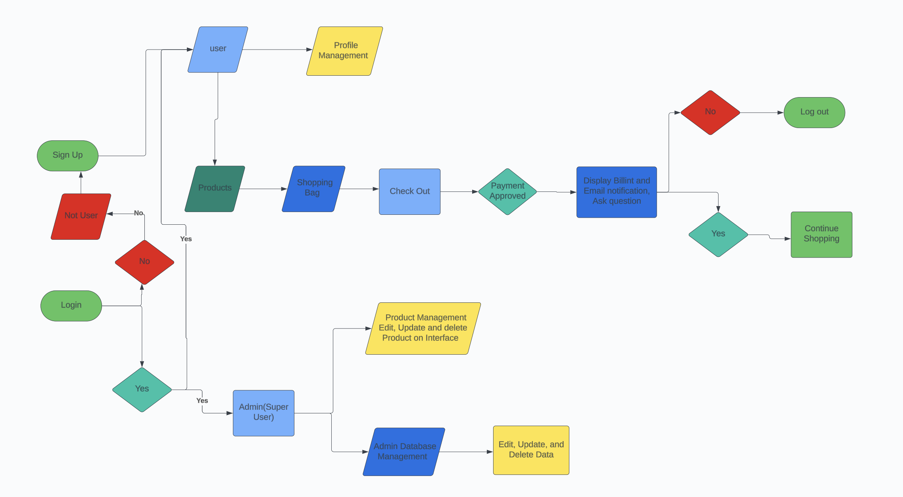

# Thai-Food-Superstore
### Deployed website:[ Link to website]()

### card number for payment testing: 4242 4242 4242 4242

## About
"Thai Food Superstore" is an e-commerce website that provides a convenient and accessible shopping platform for individuals to purchase various Thai products and ingredients online. It has a login system, a shopping cart, a checkout system, and a payment system. This website has a notification system if they submit a request. In addition, it has personnel functionality that allows the admin, manager, and other personnel to manage the website. The multiple implementation functions are due to the desire to create something reusable in the real world.

## UX
Thai Food Superstore website was created to have straightforward navigation, eye-catching, high-quality images, product detail, user-friendly variety, Global reach, conscious shopping, transparent pricing and 
 shipping, and enjoyable shopping experience for those interested in exploring rich and diverse flavours of Thai cuisine. The website is designed to be simple and easy to use, attracting customers to sign up to get discounts and information on offers. Also, functionality and efficiency for admins to manage and achieve the business goal.

 ## Target Audience
 This website is designed for Thai people and those interested in exploring and enjoying purchasing food products and ingredients of Thai cuisine.

## User Stories
## First Time Visitor
| Issue ID         |          User Story                      |
|------------------| ----------------------------------------- |
|[1]()|As a First Time Visitor, I want to be able to easily understand the main purpose of the app so that I can navigate through the app and learn more about this app.|
|[2]()|As a First Time Visitor, I want to register my account to learn the app's benefits as a user.|
|[3]()| As a First Time Visitor, I want to be able to log in or log out to access my personal account information.|
|[4]()|As a First Time Visitor, I want to be able to recover my password in case I forget it so that I can recover access to my account.|
|[5]()|As a First Time Visitor, I want to be able to receive an email confirmation after registering so that I can verify my account registration was successful.|
|[6]()|As a First Time Visitor, I want to have a personalized user profile so that I can view my personal order history and order confirmation and save my payment information.|
|        |                                         |

### Regular User(customer)
| Issue ID         |          User Story                      |
|------------------| ----------------------------------------- |
|[6]()|As a Regular User, I want to be able to access my account easily so that I can check my account details and order history.|
|[7]()|As a Regular User, I want to feel my personal details and payment information is protected and secure so that I can be confident to provide the needed information to make a purchase.|
|[8]()|As a Regular User, I want to be able to view a list of products so that I can select some to purchase.|
|[9]()|As a regular user, I want to be able to view individual product details so that I can identify the price, description, special product offers, product image, and available sizes.|
|[10]()|As a Regular User, I want to be able to easily view the total of my purchases at any time so that I can avoid spending too much and purchasing the wrong item.|
|[11]()|As a Regular User, I want to be able to sort the list of available products so that I can easily identify the best-priced and categorically sorted products.|
|[12]()|As a Regular User, I want to be able to sort a specific category of product so that I can find the best priced and specific category or sort the products in that category by name.|
|[13]()|As a Regular User, I want to be able to easily see what I've searched for and the number of results so that I can quickly decide whether the product I want is available.|
|[14]()|As a Regular User, I want to be able to easily select the size and quantity of a product when purchasing it so that I don't accidentally select the wrong product quantity or size.|
|[15]()|As a Regular User, I want to be able to view items in my bag to purchase so that I can identify the total cost of my purchase and all items I will receive.|
|[16]()|As a Regular User, I want to be able to adjust the number of individual items in my bag so that I can easily make changes to my purchase before checkout.|
|[17]()|As a Regular User, I want to be able to easily enter my payment information so that I can check out quickly and with no hassles.|
|[19]()|As a Regular User, I want to be able to view an order confirmation and checkout so that I can verify that I haven't made any mistakes.|
|[20]()|As a Regular User, I want to receive an email confirmation after checking out so that I can keep the confirmation of what I've purchased for my records.|
|[21]()|As a Regular User, I want to be able to change my profile data so that I can keep my profile up to date.|
|[22]()|As a Regular User, I want to add, edit, and delete addresses so that I can be sure that I will receive my order at the correct address.|
|[23]()|As a Regular User, I want to be able to change my primary address so that I can set the primary address without editing it.|
|       |         |

### Admin
| Issue ID         |          User Story                      |
|------------------| ----------------------------------------- |
|[24]()|As an Admin, I want to be able to add products so that I can add new items to my store.|
|[25]()|As an Admin, I want to be able to edit and update products so that I can change product prices, descriptions, images, and other product criteria.|
|[26]()|As an Admin, I want to be able to delete so that I can remove items that are no longer for sale.|
|[27]()|As an Admin. I want to be able to send special discounts email notifications, so that I can inform customers about special offers.|
|[28]()|As an Admin, I want to be able to add promotions so that I can increase sales and enhance customers.|
|[29]()|As an Admin, I want to be able to be aware of units sold so that I can be aware of sales on a particular product.|
|                   |           |
## Business Model
The business model is B2C, meaning that the company sells products to customers only. It focuses on individual transaction only.
## A personal summary of the customer
The Thai Food Superstore is aimed at those interested in exploring Thai cuisine's rich and diverse flavours. The store provides everyone with the best possible service. The age criteria on this website are customers who are 18 and older. The emphasis was made on providing a good user experience for the customers. This allows them to find the products they are looking for, gives them all available options for these products, and offers the best possible service.

## Strategy Trade-Off

* a wide variety of Thai cuisine product offerings
* product availability
* product quality
* product choice
* good user experience
* good service
* Good sales
### Web Marketing 
Newsletter were implemented in the email_notification app.
#### Strategies
* Practical web marketing strategies
  * SEO(Search Engine Optimization)
  * Content marketing
  * Social Media Marketing
  * Email marketing
    - Newsletters were implemented in the email notification app. The admin can create a newsletter and send it to all customers using Django EmailMultiAlternatives. It also handles sending newsletters about promo codes and special offers.
    
    
    
  * Paid advertising(Future improvement)
#### Free Marketing
* Facebook & Mailchimp
Facebook is essential for the store to reach customers. According to the statistics, the store has a good reach among people who prefer to use Facebook and many groups related to Thai cuisine, for example, the Thai market and Thai students in the UK.
* Instagram
Instagram is good for promoting products because it is primarily a visual platform and is good for building recognition and trust among followers. Hashtags are crucial for increasing the discoverability of posts on Instagram and can help reach a wider audience and attract users who are interested in Thai food products.
* Twister
Twister is a real-time platform where users can engage in conversations, updates, and interact with content. Twitter Moment allows the website to curate and showcase top tweets, images, and videos around specific events, campaigns, special offer, or topics to increase product visibility and engagement, drive website traffic, and generate leads or sales. It also gets feedback from users in real-time.

#### GDPR(General Data Protection Regulation)
* Privacy policy & cookie consent is Aimed at a diverse

### Search Engine Optimization
#### Key word
- Keyword research steps
  assess keyword choices for relevance and authoritativeness, and dig into the data available on keyword volume and competition using wordtracker.com[wordtracker.com](https://www.wordtracker.com/search?query=thai%20food)
  
  
  
  
- Short-tail Keyword 
  - thai food, thailand, food in thailand, thai curry, thai food online, thai, thai food shop, bangkok, bangkok cutsine, chiangmai
- Long-tail Keyword
  - thai food near me, order thai food near me, best thai food near me, thai food delivery near me, thai food super market online, good thai food mear me, cheap thai food near me, order thai food near me, order thai food near me, thai food recipes, thai food restaurant near me, authentic thai food me, thai food take out near me, traditional thai food, thai red curry, thai signature dish,tThai green curry, How to cook thai food, How to cook thai curry, thai curry ingredients, what to eat in thailand, thailand trip,wWhole sale thaifood, best thaifood online, one night in bangkok, one night in bangkok

## Future Development
* Live chat support
* Sorting products by rating and reviews
* Third-party registration
* Payment system
* Order cancellation
* Delivery cost calculation

## Technologies used
### Languages
* Python 3.12.2
* JS
* HTML
* CSS
### Framworks and libraries
* Django
* jQuery
* jQuery User Interface
### Databases
* PostgreSQL

### Other tools
* Git
* Pip3
* Gunicorn
* Psycopg2
* Django-allauth
* GitHub
* VSCode
* Chrome DevTools
* Font Awesome
* Coolors
* W3c Validator
* W3c CSS Validator
* JShint
* PEP8
* Stripe
* Sitemap Generator
* Privacy Policy Generator
* Django-extensions

## Features

## Design
### Color Scheme
[Color hex link](https://www.color-hex.com/)
[Image color picker link](https://imagecolorpicker.com/)
#### White

#### Blue

#### Red

#### Green

#### Grey

#### Black

### Typography
### Imagery
* [Logo image](https://www.istockphoto.com/vector/tom-yum-kung-curry-in-white-bowl-on-a-white-background-gm1693572022-537880168)
* [Pad thai image](https://www.istockphoto.com/photo/pad-thai-with-shrimp-and-vegetables-on-table-gm2129520437-567899782)
* [Float market image](https://www.istockphoto.com/photo/famous-damnoen-saduak-floating-market-in-thailand-farmer-goes-to-sell-organic-gm1469348511-500610238)
* [Chilli paste image](https://www.istockphoto.com/photo/korean-gochujang-gm1447041218-484956329)
* [Thai herb image](https://www.istockphoto.com/photo/thai-curry-paste-consisting-of-garlic-birds-eye-chili-pepper-galangal-etc-gm1598818473-530015331)
* [Green curry image](https://www.istockphoto.com/photo/green-curry-with-chicken-gm619628284-108077649)
## Wire frames And UI
* Home page wire frames

* Home page UI

* All product page UI

* Fruits and Vegetable page

### Agile Methodology
#### GitHub Project Management

## Flowcharts

## Information Architecture
### Database
#### Entity-Relationship Diagram

### Data Modeling

## Testing
## Credits
## Acknowledgments

